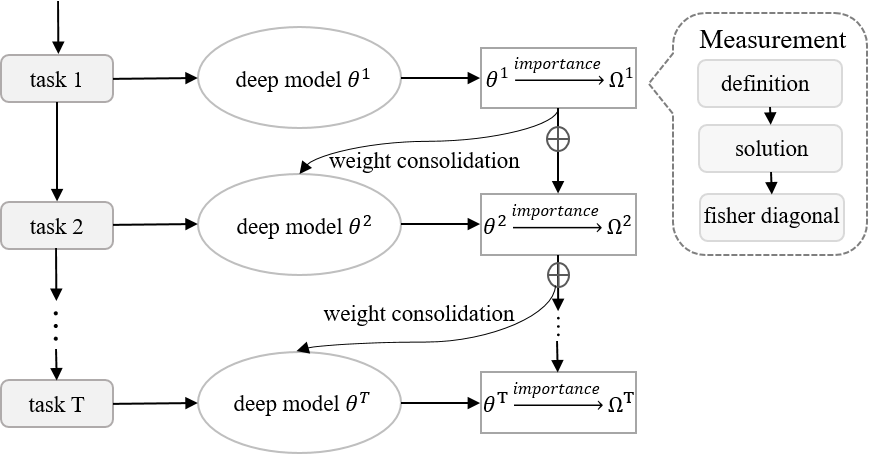

# Learning_by_memory
This is the source code for the manuscript titled Overcome Catastrophic Forgetting by Soft Parameter Pruning
The manuscript is available at http://arxiv.org/abs/1812.01640

# CL_SPP

## Approach 
Catastrophic forgetting is a challenge issue in continual learning when a deep neural network forgets the knowledge acquired from the former task after learning on subsequent tasks. However, existing methods try to find the joint distribution of parameters shared with all tasks. This idea can be questionable because this joint distribution may not present when the number of tasks increase. On the other hand, It also leads to "long-term" memory issue when the network capacity is limited since adding tasks will "eat" the network capacity. In this paper, we proposed a Soft Parameters Pruning (SPP) strategy to reach the trade-off between short-term and long-term profit of a learning model by freeing those parameters less contributing to remember former task domain knowledge to learn future tasks, and preserving memories about previous tasks via those parameters effectively encoding knowledge about tasks at the same time. The SPP also measures the importance of parameters by information entropy in a label free manner. The experiments on several tasks shows SPP model achieved the best performance compared with others state-of-the-art methods. Experiment results also indicate that our method is less sensitive to hyper-parameter and better generalization. Our research suggests that a softer strategy, i.e. approximate optimize or sub-optimal solution, will benefit alleviating the dilemma of memory.


Weight consolidation for overcoming catastrophic forgetting

Framework for continual learning on T sequential tasks


## Implementation
In this repository, CL_SPP is implemented by tensorflow 1.3.0，Python 3.5，cuda 8.0 and openCV 3.3.1.

## Augmentation 
In the experiment of incremental learning Caltech-101, we used data augmentation as follows:

  * rotation: 90 degree
  * random resize: [224，224，3]
  * mirror: random 
  * flip: random and horizontal flip


## Note: 
1. To quickly search the best hyper-parameters, we used a greedy search strategy: we firstly adjusted the optimal learning rate and then random searched the optimal lambda.
2. The experiments on split-MNIST and CIFAR10/SVHN/NOT-MNIST/STL-10 were implemented on original datasets with a size of 32*32.
3. The batch size is 128. 
4. The original model on Caltech-101 is resnet18.

## Training 
In this repository, we present 3 experiments on SPP, including split-MNIST, CIFAR10/SVHN/NOT-MNIST/STL-10 and Caltech-101. Each folder contains SPP and baselines.
You can get the result of SPP and other 8 methods via running the script with the corresponding name, for instance /exp_split_MNIST/SPP/ours.py or /exp_split_MNIST/ewc/ewc.py

## Citation 
Please consider citing this paper, if this repo is useful to your research:\
```
@article{Peng2018cl, 
    title={Overcoming Catastrophic Forgetting by Soft Parameter Pruning}, 
    author={Peng, Jian and Jiang, Hao and Li, Zhuo and Guo, Enqiang and Wan, Xiaohong and Deng, Min and Zhu, Qing and Li, Haifeng}, 
    journal={arXiv:1812.01640}, 
    year={2018}
}
```
